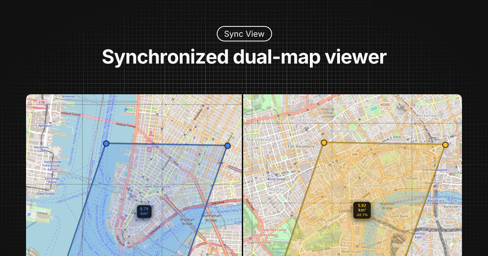

# Sync View
Sync View is a synchronized dual-map viewer for quickly comparing locations, distances, and areas between two map views.

Live demo: https://dshot92.github.io/syncview

## Libraries used

- [Leaflet](https://leafletjs.com/)
- [Turf.js](https://turfjs.org/) (area calculation for self-intersecting polygons)
